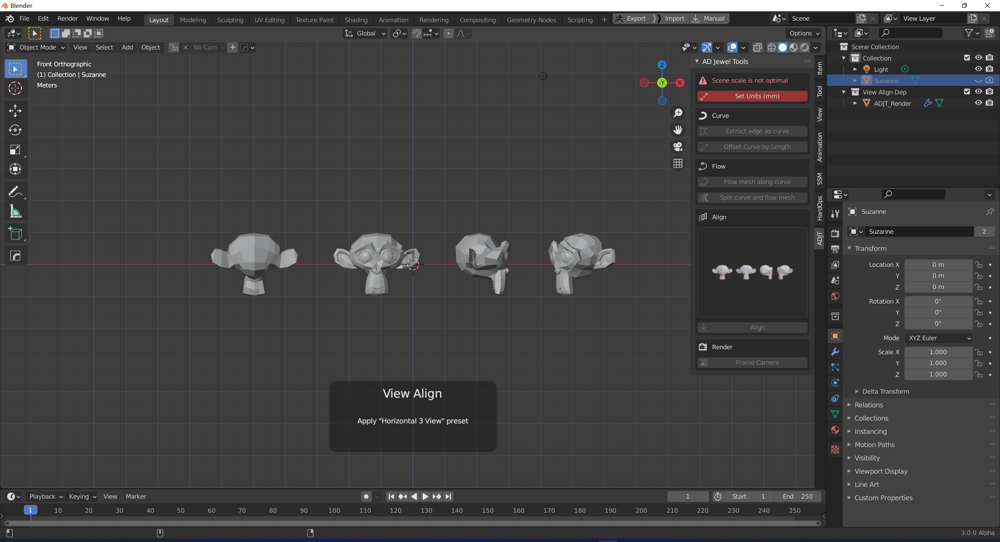

# AD Jewel Tools

> AD的珠宝小工具，开发中~

### 0.5 Feature

#### Scene settings

+ Set the scene unit to mm

#### Curve

+ Edge to curve 

  + Select the edge in edit mode and click to convert it into a separate curve object

+ Offset curve by length (support modal)

  + Calculate the curve length and offset the curve origin by the curve length (optional direction)

#### Flow

+ Flow grid to curve (support modal)

  + Select the object and curve (the curve is the active item), and click to flow the grid to the curve (array is available)

+ Separate curves and flow mesh

  + Select the object and curve (the curve is the active item), separate the curve to the new curve object according to the loose block, and copy and flow the current object to each new curve

#### Render

+ View placement (support modal)

  + Using geometry nodes to generate specific three views, you can control the perspective rotation (to be changed to the preset mode)

+ Generate framed camera (support modal)

  + Generate a frame camera for the selected object, and customize the safe pixel area

#### 场景设置

+ 设置场景单位为毫米

#### 曲线

+ 边到曲线 
  + 编辑模式下选中边，点击后转换为单独曲线物体
+ 按长度偏移曲线 (支持模态)
  + 计算曲线长度并按曲线长度偏移曲线原点（可选方向）

#### 流动

+ 流动网格至曲线 (支持模态)
  + 选中物体与曲线（曲线为激活项），点击后将网格流动至曲线（可阵列）
+ 分离曲线并流动网格
  + 选中物体与曲线（曲线为激活项），按松散块分离曲线到新曲线物体，并将当前物体复制并流动到每个新曲线上

#### 渲染

+ 视图摆放 (支持模态)
  + 使用几何节点生成特定三视图，可控制透视图旋转
+ 生成框选相机 (支持模态)
  + 对选中物体生成一个框选相机，并可自定义安全像素区域
